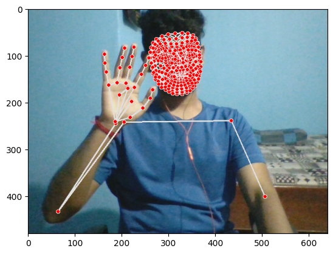
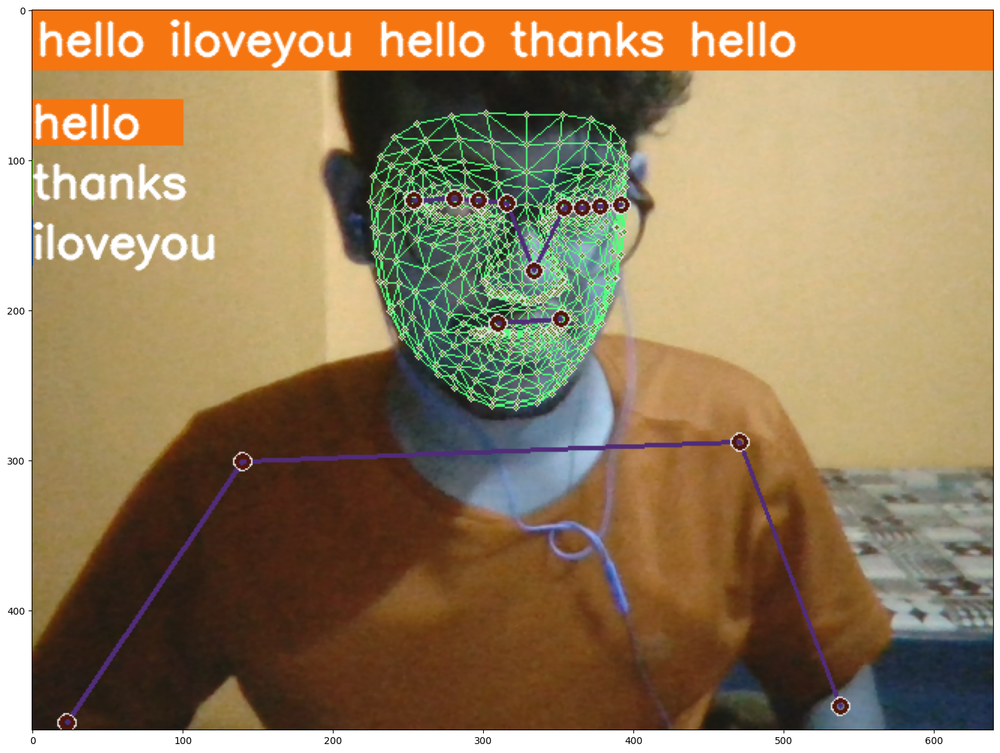

# Sign Language Prediction using LSTM Deep Learning Model


## Introduction

This project implements a Sign Language Prediction system using a Long Short-Term Memory (LSTM) Deep Learning Model. The goal is to recognize three sign language actions: "Hello," "I Love You," and "Thank You." The project utilizes the `mediapipe` library to extract holistic keypoints of the face and body from recorded videos, preprocesses the data, builds and trains an LSTM neural network using TensorFlow, and makes predictions on new sign language videos.

## Dependencies

Make sure you have the following dependencies installed:

- Python (version 3.10)
- mediapipe (install using `pip install mediapipe`)
- opencv-python (install using `pip install opencv-python`)
- numpy (install using `pip install numpy`)
- tensorflow (install using `pip install tensorflow`)

## Installation

1. Clone the repository:

```bash
git clone https://github.com/mohaneesh-03/Sign-Language-Prediction.git
cd sign-language-prediction
```

2. Install the required dependencies:

```bash
pip install mediapipe
pip install opencv-python
pip install numpy
pip install tensorflow
pip install matplotlib
```

## Usage

### 1. Data Collection:

- Create three folders inside the "data" directory, one for each sign language action: "hello," "i_love_you," and "thank_you."
- Record videos of yourself performing each sign language action and save them in the corresponding folders.
- The data folder of this project is [MP_DATA](MP_DATA/)

### 2. Extract Keypoint Values:

- extract the holistic keypoints from the recorded videos.
```
def extract_keypoints(results):
    pose = np.array([[res.x, res.y, res.z, res.visibility] for res in results.pose_landmarks.landmark]).flatten() if results.pose_landmarks else np.zeros(132)
    face = np.array([[res.x, res.y, res.z] for res in results.face_landmarks.landmark]).flatten() if results.face_landmarks else np.zeros(1404)
    lh = np.array([[res.x, res.y, res.z] for res in results.left_hand_landmarks.landmark]).flatten() if results.left_hand_landmarks else np.zeros(21*3)
    rh = np.array([[res.x, res.y, res.z] for res in results.right_hand_landmarks.landmark]).flatten() if results.right_hand_landmarks else np.zeros(21*3)
    return np.concatenate([pose, face, lh, rh])
```


### 3. Preprocess Data:

- Preprocess the extracted keypoints, creating the necessary labels and features for training the LSTM model.
```
sequences, labels = [], []
for action in actions:
    for sequence in range(no_seq):
        window = []
        for fnum in  range(seq_len):
            res = np.load(os.path.join(DATA_PATH, action, str(sequence), "{}.npy".format(fnum)))
            window.append(res)
        sequences.append(window)
        labels.append(label_map[action])
```

### 4. Build and Train the LSTM Model:

- Build the LSTM neural network using TensorFlow.
- Train the model using the preprocessed data obtained in the previous step.
- Follwoing is the LSTM model for this project
```
model = Sequential()
model.add(LSTM(64, return_sequences=True, activation='relu', input_shape=(30,1662)))
model.add(LSTM(128, return_sequences=True, activation='relu'))
model.add(LSTM(64, return_sequences=False, activation='relu'))
model.add(Dense(64, activation='relu'))
model.add(Dense(32, activation='relu'))
model.add(Dense(actions.shape[0], activation='softmax'))
```

### 5. Save Model Weights:

- After training the LSTM model, save the model weights to a file (e.g., `sign_language_lstm.h5`).
- The weights file for this project is [actions.h5](action.h5)

### 6. Make Predictions:

- Load the trained model weights and make predictions on new sign language videos.
  
  

## Note

- It is essential to collect a diverse and balanced dataset for training to ensure accurate sign language predictions.
- Experiment with different hyperparameters and data augmentation techniques to improve the model's performance.
- Always record videos in well-lit environments with clear hand gestures for better accuracy.


## Acknowledgments

We would like to thank the creators of the `mediapipe` library and the TensorFlow team for their contributions to the deep learning community.


---
